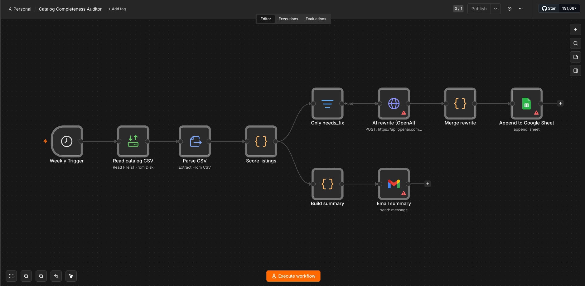

# AI-Powered Product Catalog Completeness Auditor
*One-page overview — paste into Canva/Notion and export as PDF for your application.*

## The problem it solves
Ecommerce stores lose sales and SEO ranking to thin, inconsistent, or incomplete
product listings — and no one has time to audit thousands of them by hand.

## What it does (one line)
Audits an entire product catalog, scores every listing 0–100 on content quality,
auto-rewrites the worst with AI, and delivers a prioritized fix queue to Google
Sheets — on a weekly schedule.

## The pipeline (n8n)

*Weekly Trigger → Read CSV → Score (5 dimensions) → Filter "needs_fix" → AI Rewrite
→ Google Sheets fix queue, with a parallel branch that emails a summary.*

## Scoring dimensions (20 pts each = 100)
description length · price present · title quality · category present · readability
Listings under **60** are flagged and queued for an AI rewrite.

## Before / after example (real output, generated with Groq)
**Before** (scored 32/100 — title too short, no category, thin description):
> **Title:** Bottle
> **Description:** Nice bottle.

**After** (AI-rewritten, SEO-optimized):
> **Title:** Premium Glass Water Bottle - 27oz Insulated Hydration Container
> **Description:** Stay refreshed on-the-go with our premium glass water bottle,
> featuring a 27oz capacity, insulated design, and BPA-free construction for a
> healthy and sustainable hydration experience.
> **SEO keywords:** glass water bottle, insulated bottle, hydration container, refillable bottle, eco-friendly bottle

*Reproduce with `node scripts/audit.js` — results land in `output/fix_queue.csv`.*

## Tools used
n8n (orchestration) · OpenAI gpt-4o-mini (rewriting) · Google Sheets API (output)
· Gmail (reporting) · JavaScript (scoring logic)

## Deployment
> This workflow can be deployed for any **Shopify** or **BigCommerce** store with a
> product export — swap the CSV read for an HTTP Request to the store's product API.
